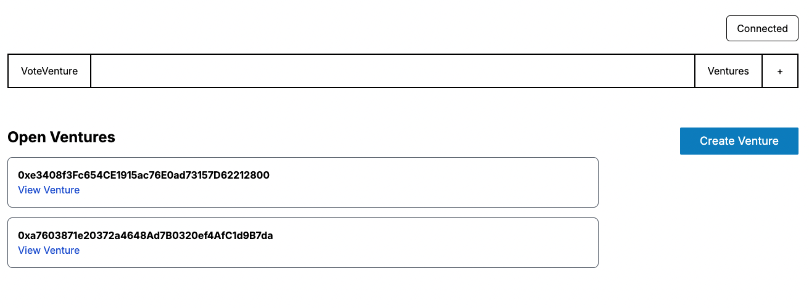
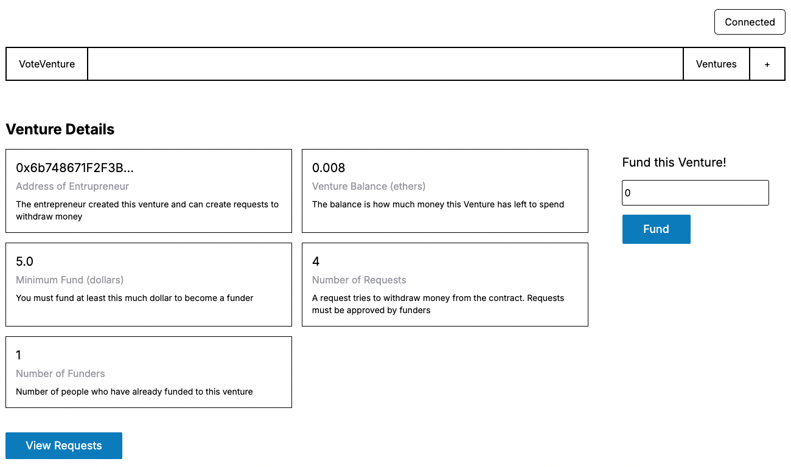
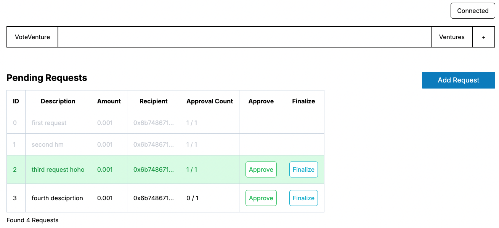

# VoteVenture

**VoteVenture** is a dApp that helps entrepreneurs bring their ideas to life with support from the community. Users can fund ventures, and all funds are managed transparently through smart contracts on the blockchain.





## How It Works

- **Create Ventures:** Entrepreneurs can start a venture, sharing their business idea and seeking funding from others.
- **Fund Ventures:** Users can back ventures they believe in, as long as they meet the minimum funding requirement.
- **Manage Funds:** Entrepreneurs can request to use the funds for specific needs, but only if the backers approve.
- **Approve Requests:** Funders get to vote on spending requests. The funds are only released if a majority says yes, making sure everything’s on the up-and-up.

## Features

- **Wallet Connection:** Easily connect your wallet to get started.
- **Venture Creation:** Entrepreneurs can launch new ventures and look for funding.
- **Fund Management:** Funds are managed transparently, with funders voting on spending requests.
- **Real-time Price Feeds:** Thanks to Chainlink, we’ve got up-to-date price feeds to ensure accurate funding.
- **Voting System:** Funders have a say in how the money is spent, keeping things fair and transparent.

## Tech Stack

- **Frontend:** React, Next.js, ethers.js
- **Smart Contracts:** Solidity (Foundry)
- **Blockchain:** Sepolia Testnet
- **Oracle:** Chainlink Price Feeds
- **Tools:** Foundry, Alchemy

## Development & Testing

The project utilizes unit and integration tests to ensure the reliability of the smart contracts. The primary objective of this project is to serve as a practical learning experience, enabling me to enhance my development skills in the areas of Solidity.

## Setup and Installation

To get the project up and running locally:

```bash
git clone https://github.com/yourusername/voteventure.git
cd voteventure
